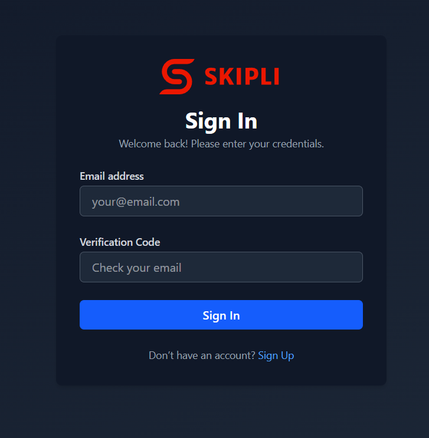
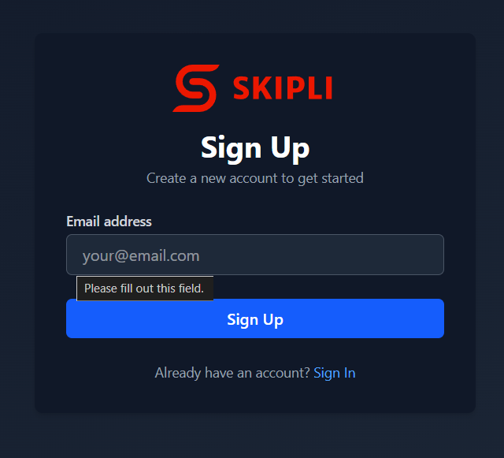
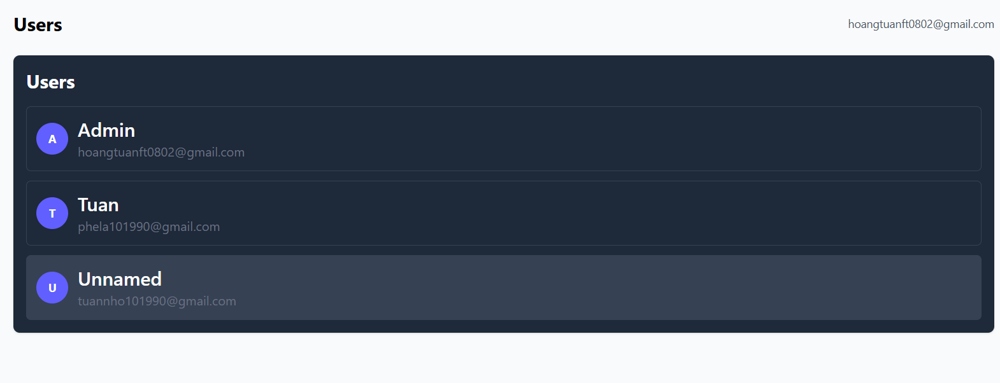
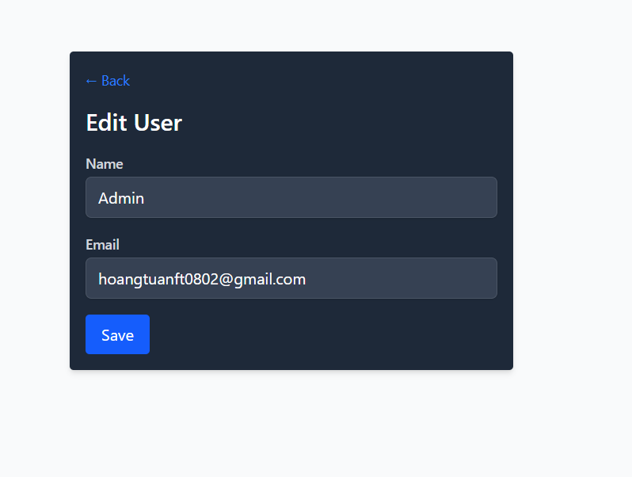
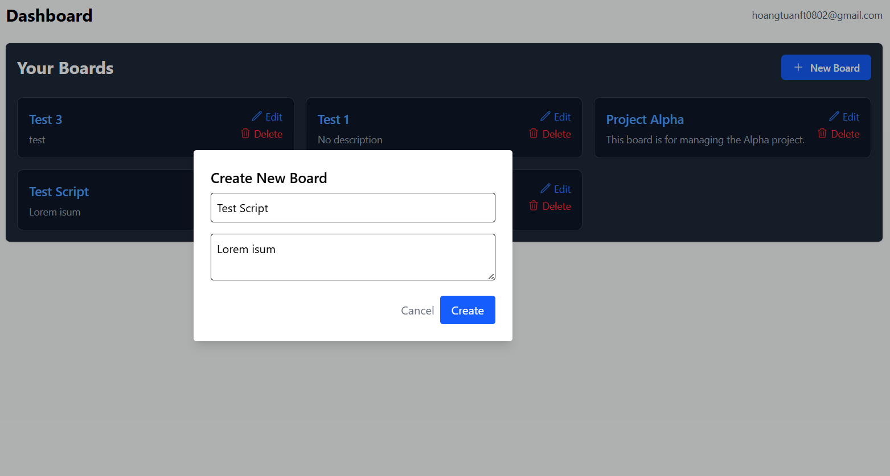
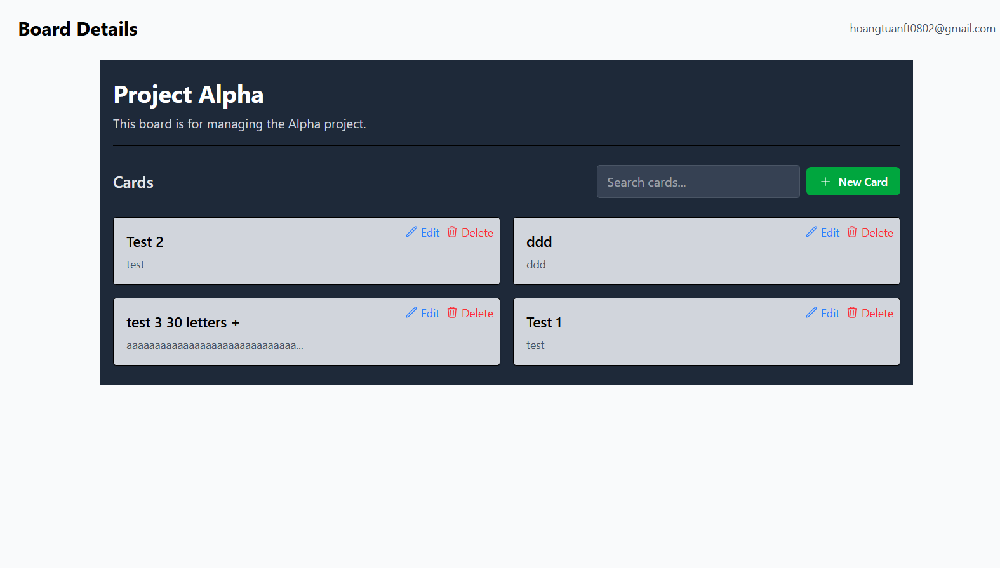
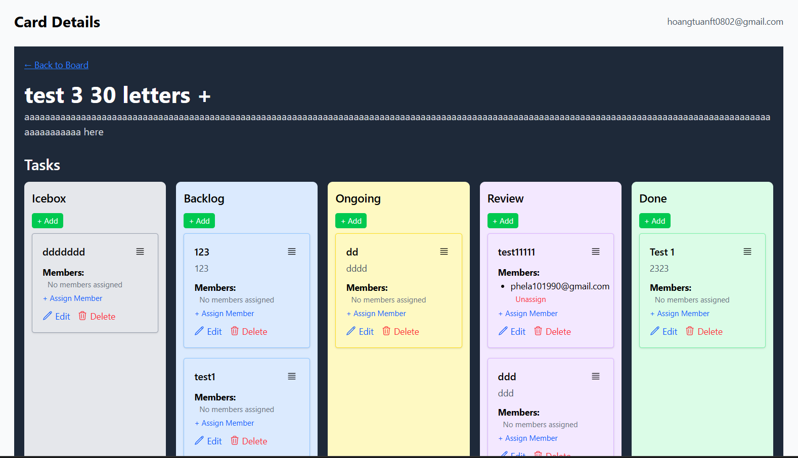
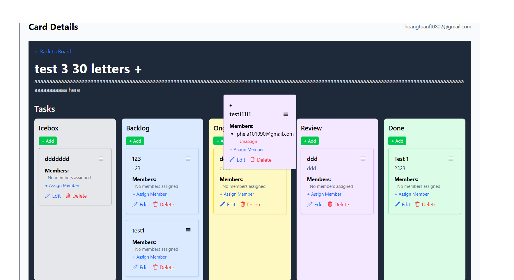

# Skipli Task Management App 🧩

A Trello-like real-time task management web application built with **React**, **Express**, **Firebase**, and **GitHub API integration**.

## 🚀 Features

- 🧾 Create and manage boards and cards
- ✅ Kanban-style drag-and-drop task board
- 👥 Assign/unassign members to tasks
- 🔐 Email-based authentication with verification code
- 🔗 GitHub integration (commits, issues, pull requests)
- 🌗 Dark mode support
- 🔄 Real-time collaboration via WebSocket
- 📱 Fully responsive for mobile and desktop

---

## 🛠️ Tech Stack

| Frontend            | Backend           | Realtime  | Auth          | Database  | 3rd Party  | | API Document|
| ------------------- | ----------------- | --------- | ------------- | --------- | ---------- | | ----------- |
| React + TailwindCSS | Node.js + Express | Socket.io | Firebase Auth | Firestore | GitHub API | |   Swagger   |

---

## ⚙️ Getting Started

### Prerequisites

- Node.js >= 18
- Firebase project with authentication + Firestore enabled
- GitHub OAuth App credentials

### 1. Clone the repository

Git clone https://github.com/tuannho0802/Real-Time-Board-Management-Tool

### 2. Environment variables

Create a .env file in the root directory and fill in your Firebase & GitHub credentials:

```
PORT=5000
JWT_SECRET=your_super_secret_key
EMAIL_USER=your_google_app_email
EMAIL_PASS=your_google_app_password
GITHUB_TOKEN=your_github_token_here
GITHUB_CLIENT_ID=your_client_id_here
GITHUB_CLIENT_SECRET=your_client_secret_here
GITHUB_CALLBACK_URL=http://localhost:5000/auth/github/callback
```

### 3. Run the application

Start the backend:

```bash
cd skipli-backend

npm install

npm run dev
```

Start the frontend:

```bash
cd skipli-frontend

npm install

npm run dev
```

Visit: http://localhost:5173

## 📸 Screenshots

### 🔐 Authentication




### 👨‍💻 User




### 🧠 Dashboard (Boards)





### 📌 Card (Tasks)




## 🙏 Acknowledgements

Firebase: https://firebase.google.com/

React: https://react.dev/

Socket.IO: https://socket.io/

GitHub REST API: https://docs.github.com/en/rest

## Documentation

[Idea: Create a responsive web application using React.js with real-time updates using WebSocket technology.](https://docs.google.com/document/d/1gbtbTnqAmc-lIBXN63c6K5RubBWX8wUll9Is6xd1nds/edit?tab=t.0)

## Authors

- [HoangTuanFT](https://github.com/tuannho0802)
