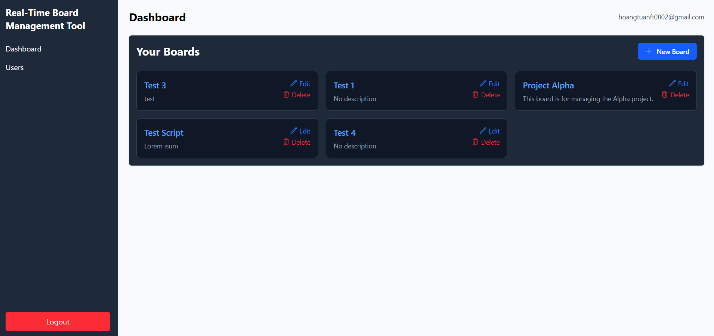

# Skipli Task Management App 🧩

A Trello-like real-time task management web application built with **React**, **Express**, **Firebase**, and **GitHub API integration**.

## 🚀 Features

- 🧾 Create and manage boards and cards
- ✅ Kanban-style drag-and-drop task board
- 👥 Assign/unassign members to tasks
- 🔐 Email-based authentication with verification code
- 🔗 GitHub integration (commits, issues, pull requests)
- 🌗 Dark mode support
- 🔄 Real-time collaboration via WebSocket
- 📱 Fully responsive for mobile and desktop

---

## 🛠️ Tech Stack

| Frontend           | Backend            | Realtime | Auth           | Database  | 3rd Party     | API Docs   |
|--------------------|--------------------|----------|----------------|-----------|----------------|------------|
| React + TailwindCSS| Node.js + Express  | Socket.io| Firebase Auth  | Firestore | GitHub REST API| Swagger UI |

---


## ⚙️ Getting Started

### Prerequisites

- Node.js >= 18
- Firebase project with authentication + Firestore enabled
- GitHub OAuth App credentials

### 1. Clone the repository


Git clone https://github.com/tuannho0802/Real-Time-Board-Management-Tool


### 2. Environment variables
Create a .env file in the root directory and fill in your Firebase & GitHub credentials:

```
PORT=5000
JWT_SECRET=your_super_secret_key
EMAIL_USER=your_google_app_email
EMAIL_PASS=your_google_app_password
GITHUB_TOKEN=your_github_token_here
GITHUB_CLIENT_ID=your_client_id_here
GITHUB_CLIENT_SECRET=your_client_secret_here
GITHUB_CALLBACK_URL=http://localhost:5000/auth/github/callback
```
---
### 3. Run the application
Start the backend:
```bash
cd skipli-backend

npm install

npm run dev
```

Start the frontend:
```bash
cd skipli-frontend

npm install

npm run dev
```
Visit: http://localhost:5173
---
## 📚 API Documentation

The backend includes interactive API documentation using **Swagger UI**.

After starting the backend, you can access the docs at:

📄 [`http://localhost:5000/api-docs`](http://localhost:5000/api-docs)

The Swagger docs include:

- 🧾 `POST /signin` – Sign in with email + verification code  
- 🧾 `POST /signup` – Register a new user  
- 📋 `GET /boards` – Get all boards  
- ➕ `POST /boards` – Create a new board  
- 🎴 `GET /boards/:boardId/cards` – List cards in a board  
- ✅ `GET /boards/:boardId/cards/:cardId/tasks` – Get tasks  
- 🔗 `POST /.../github-attach` – Attach GitHub items  
- ... and more.

You can test and inspect all endpoints directly from Swagger.

---
## 📸 Screenshots
 ### 🔐 Authentication


### 👨‍💻 User


### 🧠 Dashboard (Boards)



### 📌 Card (Tasks)


---
## 🙏 Acknowledgements
Firebase: https://firebase.google.com/

React: https://react.dev/

Socket.IO: https://socket.io/

GitHub REST API: https://docs.github.com/en/rest


## 📝 Documentation

[Idea: Create a responsive web application using React.js with real-time updates using WebSocket technology.](https://docs.google.com/document/d/1gbtbTnqAmc-lIBXN63c6K5RubBWX8wUll9Is6xd1nds/edit?tab=t.0)


## Authors

- [HoangTuanFT](https://github.com/tuannho0802)

